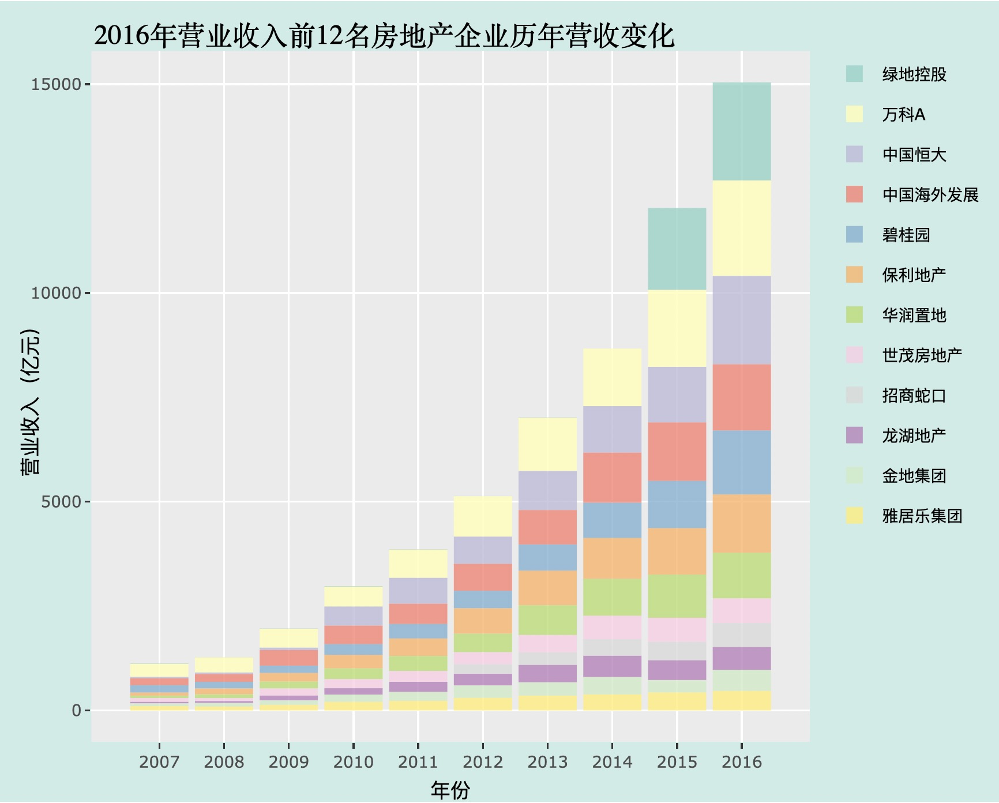

### 1. 用5行以内的R代码进行财务数据可视化系列（1）：用柱状图展示市场份额变化

**内容提要:** 企业的市场份额变化是财务数据分析中经常要考虑的问题。这篇博客展示了如何通过我们的工具包用5行以内的R代码完成这一任务。

**博文链接:** [柱状图展示市场份额变化](https://icssai.github.io/HelpPage/Blogs/blog1.html)

**结果预览:**

